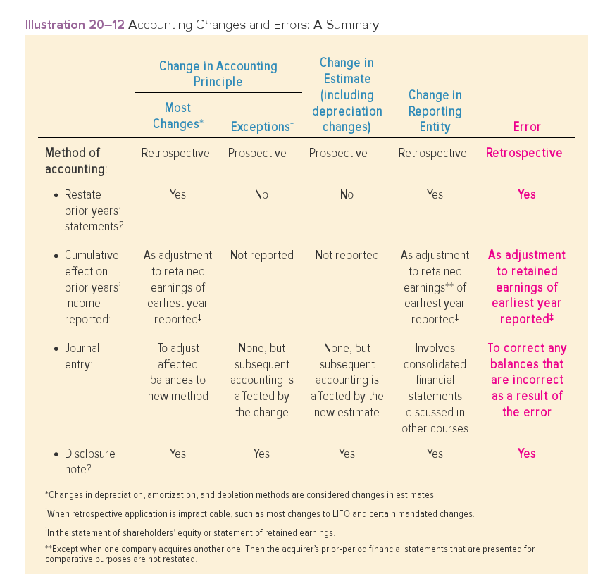

If retained earnings is one of the accounts that requires adjustment due to a change in accounting principle (and it usually is), we must adjust the beginning balance of the retained earnings account for the earliest period reported in the comparative statements of shareholders equity.

The amount of the revision is the cumulative effect of the change of years prior to that date.

Illustration 20-3B

```
| - | - | $ in millions | Common Stock | APIC | Retained Earnings | Total S/E

Jan 1, 2016 | - | - | $880
  net income | - | - | $186
  dividends | - | - | $(40)
December 31, 2016 | - | - | $1,026
  net income (revised to FIFO) | - | - | $195
  dividends | - | - | $(40)
December 31, 2017 | - | - | $1,187
  net income (using FIFO) | - | - | $210
  dividends | - | - | $(40)
December 31, 2018 | - | - | $1,357
```

# Adjust accoaunts for the change
```
$ in millions | 2017 | 2016 | Cumulative difference pre-2016 | Cumulative difference pre-2018
Cost of Goods Sold (LIFO) | 420 | 405 | 1,000 | -
Cost of Goods Sold (FIFO) | 365 | 360 | 7000 | -
  Difference | 55 | 45 | 300 | 400
```

The $400 million cumulative difference in CGS is also the difference between the balance in inventory and what that balance would have been if the FIFO method, rather than LIFO, had been used before 2018. Inventory must be increased to that amount.
Retained earnings must be increased by 60% of that amount due to income taxes.

# Journal entry to record change in accounting principle

```
dr. Inventory (Additional inventory if FIFO had been used) | 400 | -
  cr. Retained earnings (additional net income if FIFO had been used) | - | 240
  cr. Income tax payable ($400 x 40%) | - | 160
```

# Modified retrospective approach

We apply the new standard only to the adoption period (that is, the current period) and then adjust the balance of retained earnings at the beginning of the adoption period to capture the cumulative effects of the prior periods without actually adjusting the numbers in the prior periods reported.

# Prospective Approach: When retrospective is impracticable

Two types:

1. When it is impracticable to determine sokme period-specific effects
2. When it is impracticable to determine the cumulative effect of prior years

# Prospective Approach: When mandated by authoritative accounting literature

# Prospective Approach: Changing depreciation, amortization, and depletion methods

A change in depreciation methods is considered to be a change in accounting estimate through a change in accounting principle. It is taken care of prospectively.

# Change in accounting estimates

Accounting tasks that require changes to accounting estimates

1. Anticipating uncollectible accounts receivable
2. Predicting warranty expenses
3. Amortizing intangible assets
4. Making acturial assumptions for pension benefits

The revision of the estimate constitutes the correction of a error

Changes in accounting estimates are accounted for prospectively. When a company revises a previous estimates, prior financial statements are not revised. The company merely incorporates the new estimate from then on. A disclosure note should describe the effect of a change in estimate on income from continuing operations, net income, and related per share amounts for the current period.

# Illustration 20-7

Universal semiconductors

1. estimates warranty expense as 2% of sales
2. After a review in 2018. determined that 3% of sales is a more realistic estimate of its payment experience
3. sales in 2018 is $300m
4. effective income tax rate is 40%
5. No account balances are adjusted
6. Cumulative net effect is not reported in current income

```
dr. Warranty expense | 9 | -
  cr. Warranty liability | - | 9
```

The after tax effect of the change in estimate is $1.8m (`$300m * (3%-2%) = 3m` less `40% of $3m`)

The effect is described in a disclosure note to the financial statements as follows.

# Change in Depreciation, Amortization, and Depletion Methods

If the asset is a building, equipment, or other tangible asset the allocation process is called `depreciation`

It is referred to as `amortization` if an intangible asset and `depletion` if a natural resource.

When a company changes the way it depreciates an asset, the change would be made to reflect a change in

1. Estimated future benefits from the asset
2. The pattern of receiving those benefits
3. Company's knowledge about those benefits


Even though the company is changing its depreciation method, it is doing so to reflect changes in estimates of future benefits.

# Illustration 20-8 Change in depreciation methods

Universal Semiconducts switched from the Sum of Years Digits depreciation to straight line depreciation in 2018. The change affects its precision equipment purchased at the beginning of 2016 at a cost of $63m. The machinery has an expected useful life of five years and a estimated residual value of $3m.

Depreciation prior to change.
```
SYD Depreciation | $ in millions.
2016 depreciation | $20 | ($60 x 5/15)
2017 depreciation | $16 | ($60 x 4/15)
  Accumulated depreciation | $36
```
A change in depreciation method is considered a change in accounting estimate resulting from a cahnge in accounting principle. So the compaony reports the change prospectively, previous financial statements are not revised. The undepreciated cost remaining at the time of the change is depreciated straight-line over the remaining useful life.
```
Calculation of straight-line depreciation | $ in millions
Asset's cost | $63
Accumulated depreciation to date (calculated above) | (36)
Undepreciated cost, Jan 1, 2018 | $27
Estimated residual value | (3)
To be depreciated over remaining 3 years | $24
- | 3 Years
Annual straight-line depreciation 2018-2020 | $8
```
```
Adjusting entry ( 2018, 2019, and 2020 depreciation) | $ in millions
Depreciation expense (calculated above) | 8 | -
  accumulated depreciation | - | 8
```
# Illustration 20-9 Change in Depreciation Method for Newly Acquired Assets

It's not easy to distinguish between a change in principle and a change in estimate

For example...

```
If a company begins to capitalize rather than expense the cost of tools because their befeits beyond one year become apparent.
```

The change could be construed as either a change in principle or a cahnge in the estimated life of the asset.

When the distinction is not possible, the change should be terated as a change in estimate. The treatment is appropriate when both a change in accounting principle and a change in accounting estimate occur simultaneously.


# Change in reporting entity.

A reporting entity can be `a single company` or it can be a `group of companies that report a single set of financial statements`.

A change in reporting entity occurs as a result of

1. Presenting consolidated financial statements in place of statements of individual companies
2. Changing specific compaonies that constitute the group for which consolidated or combined statements are prepared
3. Or a result of changes in accounting rules.
4. When a company acquires another one.

Acquiring companies are required to provide a footnote that presents key financialstatement information as if the acquisition had occurred before the beginning of the previous year. At a minimum, the supplemental pro forma information should display

1. Revenue
2. Income from continuing operations
3. Net income
4. Earnings per share

A change in reporting entity is reported by recasting all pregvious period's financial statements as if the new reporting entity existed in those periods. In the first set of financial statements after the change, a disclosure note should describe the nature of the change and the reason that it occurred. Also the effect of the change on...

1. Net income
2. Income from continuing operations
3. Related per share amounts

Should be indicated for all periods presented. These disclosures aren't necessary in subsequent financial statements.

# Errors

The correction of an error is not actually a accounting change but is accounted for similarly. It is accounted for `retrospectively` like most changes sin accounting principles.
They are retrospectively restated to reflect the correction. Any account balances that are incorrect as a result of the error are corrected by journal entry.

If retained earnings is one of the incorrect amounts, the correctioin is reported as a prior period adjustment tok the beginning balance in a `statement of shareholders' equity`. A disclosure note is needed.


# Retrospective

1. Most changesd in accounting principle
2. Change ijn reporting entity
3. Corrections of Errors

# Prospective

1. Changes in estimate including changes in depreciation method
2. Changes in accounting principle when retrospective application isimpractical
3. Changes in accounting principle when prospective application is mandated



# Correction of accounting errors

1. A journal entry is made to correct any account balances that are incorrect as a result of the error
2. Retrospectively restate financial statements that were incorrect as a result of the error
3. Report as a prior period of adjustment to the beginning balance in a statement of shareholder's equity if R/E is one of the accounts incorrect as a result of the error
4. Disclosure note should describe the nature of the error and the impact of its correction on net Income

# Prior period adjustment

`Refers to an addition to OR a reduction in the beginning retained earnijngs balance in a statement of shareholders' equity or retained earnings`

When it's; discovered that the ending balance of R/E in the period prior to the discovery of an erorr was incorrect as a result oif that error, the balance must be corrected when it appears as the beginning balance the following year.

# Statements of retained Earnings
# For the years ended December 31, 2017 and 2016

Item | 2017 | 2016
Balance at beginning of year | $600,000 | $450,000
Net Income | $400,000 | $350,000
Less: (Dividends) | (200,000) | (200,000)
Balance at end ofi year | 800,000 | 600,000

# If the error in 2016 caused that year's icome to be overstated by $20,000

# Statements of retained earnings
# For the years ended December 31, 2018 and 2017

Item | 2018 | 2017
Balance at beginning of year | 780,000 | 600,000
Prior period adjustment | - | (20,000)
Corrected balance | - | 580,000
Net income | 500,000 | 400,000
Less: (Dividends) | (200,000) | (200,000)
Balance at end of year | 1,080,000 | 780,000

The prior period adjustment is applied to beginning retained earnings for the year `FOLLOWING` the error, or for the `EARLIEST` year being reported in the comparative financial statemeqnts when the error occurs `PRIOR` to  the `EARLIEST YEAR` presented.


# Error discovered in the same reporting period that it occurred

GH Little, Inc. paid $3m for replacement computers and recorded the expenditure as maintenance expense. The error was discovered a week later

To reverse errorneous entry
dr. cash  3
  cr. maintenance 3

To record correct entry
dr. equipment 3
  cr. cash  3


# Error affecting previous financial statements but not net income

MDS Transportation incorrectly recorde da $2m note recievable as accounts receivable. The error was disocvered a year later.

**Step 1**

To correct incorrect amounts
dr. notes receivable  2
  cr. accounts receivable 2

**Step 2**

When reported for comparatative purposes in the current year's annual report, last year's balnace sheet would be restated toi report the note as it should have been reported last year

**Step 3**

Since last year's net income was not affected by the error, the balance in retained earnings was not incorrect. So no prior period adjustment to that account is necessary.

**Step 4**

A Disclosure note would describe the nature of the error, but there would be no impact oin net income, income from continuing operations and earnings per share to report

# Error affecting a prior year's netincome

In 2018, internal auditors discovered that Seidman Distribution, Inc. had debited an expense account for the $7m cost of resorting equipment fpurchased at the beginning of 20916. The equipment's useful life was expectged to be five years with no residual value. Straight line depreciation is used by seidman

# Correct (Should have been recorded)

2016
dr. equipment 70
  cr. cash  70

# Incorret (as recorded)

dr. expenses 70
  cr. cash 70

# Correct

expense 14
  accumulated depreciation 14

# incorrect

depreciation omitted

# correct
2017
Expense 14
  accumulated depreciation 14

# incorrect

Dpereciation omitted

During the two-year period

Depreciation expense was understated by $2.8m, but otiher expenses were overstated by $7m, so net income during the period was understated by $4.2m. This means retained earnings is currently understated by that amount.

Accumulated depreciation is undersstated by $2.8m

**Step 1**

# To correct incorrect amounts

Equipment 70
  Accumulated Depreciation 2.8
  Retained earnings 4.2

# Illustration: 20-18 Error Affecting net income Inventory misstated
